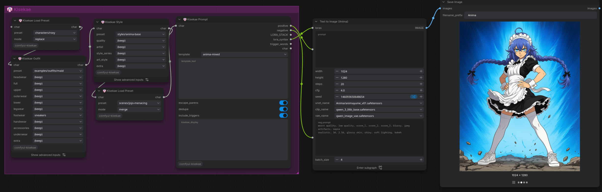
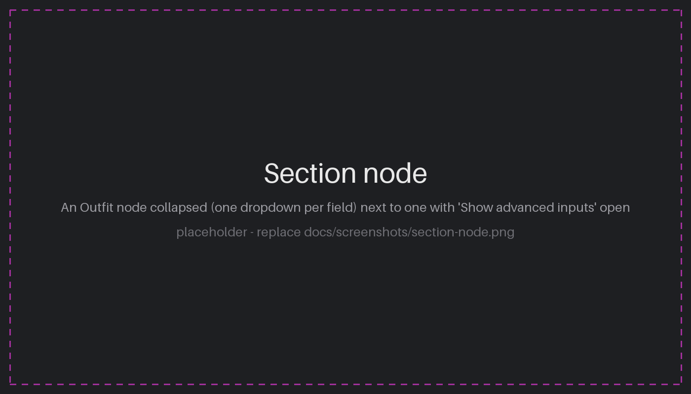
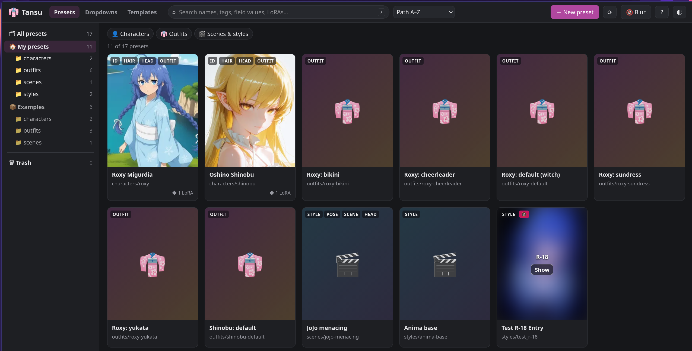
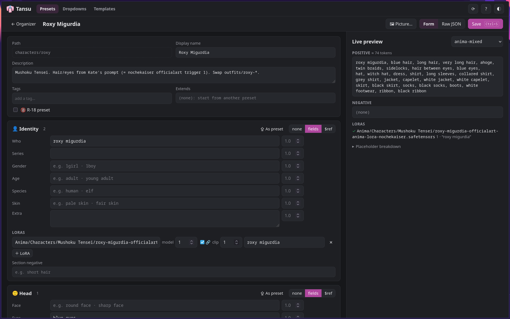
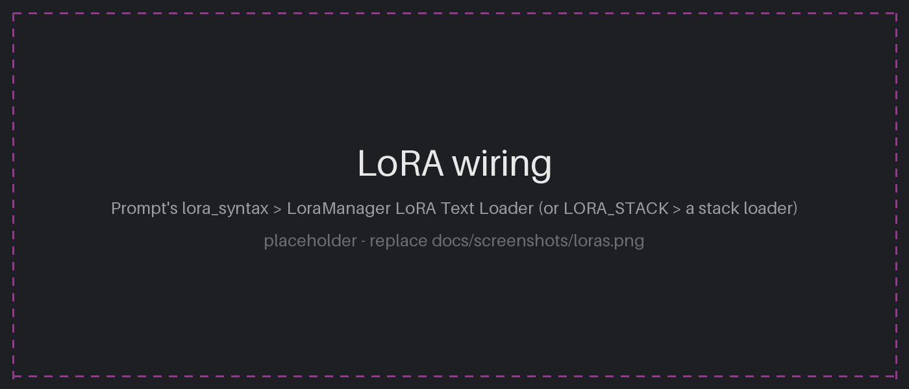
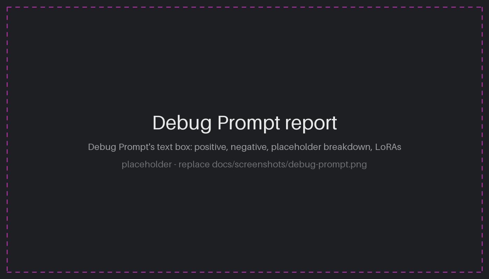

# 👘 comfyui-kisekae

着せ替え (*kisekae*, "dress-up"): character prompts for ComfyUI, built from
reusable JSON presets.

Describe a character once: hair, eyes, body, outfit, LoRA. Then swap outfits,
scenes and styles with dropdowns, without retyping the prompt. Each section
(Identity, Head, Hair, Body, Outfit, Style, Pose, Scene) is its own node. The
nodes chain together and pass the character along, and a Prompt node at the end
turns it into positive and negative prompts plus LoRAs.



## Features

- **Presets that reference each other.** A character's outfit can be
  `{"$ref": "outfits/school-uniform"}`. Change the outfit file and every character
  wearing it changes. Swap it and only the outfit changes.
- **Chained section nodes.** Each node can load a section preset, then override
  single fields with a dropdown or typed text, replacing or appending.
- **Tags and prose in one prompt.** Templates decide the layout. The default
  mixes booru tags with natural-language lines, which suits Anima-style models.
- **LoRAs live in presets.** The character's LoRA comes with the character. The
  Prompt node outputs a standard `LORA_STACK` and `<lora:name:strength>` text, so
  it works with [LoRA Manager](https://github.com/willmiao/ComfyUI-Lora-Manager)
  and other stack loaders without depending on any of them.
- **Smart dropdowns.** Picking `dress` clears the incoming top and skirt.
  Picking `short hair` adds `long hair` to the negative prompt.
- **Save Preset.** Tweak a character in the graph and save it as a new preset.
  Unchanged sections are saved as references.
- **Debug nodes.** See the character data or the rendered prompt at any point in
  a chain, including where each value came from.
- **Tansu 箪笥, a preset organizer and editor** in its own browser tab: browse
  presets as picture cards, filter by tags, edit with a live prompt preview, and
  rename or move presets with every reference updated.
- No extra Python dependencies.

## Install

Clone into `ComfyUI/custom_nodes` and restart ComfyUI:

```sh
cd ComfyUI/custom_nodes
git clone https://github.com/Kagejitsu/comfyui-kisekae
```

It is also published to the [Comfy Registry](https://registry.comfy.org) as
`comfyui-kisekae`, so ComfyUI-Manager can install it.

The nodes appear under the **kisekae** category, all named "👘 Kisekae …".

## Quick start

1. Add **👘 Kisekae Load Preset** and pick `examples/characters/aoi`.
2. Connect its `char` output to a **👘 Kisekae Outfit** node and pick
   `examples/outfits/maid` as that node's preset.
3. Add **👘 Kisekae Load Preset** again with `examples/scenes/dramatic` and
   `mode: merge`. This adds a pose, lighting and an expression on top of the
   character.
4. End with **👘 Kisekae Prompt**. Connect `positive` and `negative` to the
   `text` inputs of your two CLIP Text Encode nodes.
5. Queue. The Prompt node shows the finished prompt in its text box.

A Prompt node can attach anywhere in a chain, and a chain can branch: one
character can feed two different Outfit nodes.

### Example workflow

[`examples/workflows/anima-kisekae.json`](examples/workflows/anima-kisekae.json)
is a complete text-to-image workflow for Anima. It has a Kisekae chain (Load
Preset → Outfit → Style → Load Preset in `merge` mode → Prompt) feeding a
"Text to Image (Anima)" subgraph. Drag the file onto ComfyUI, then:

1. Pick a character on the first Load Preset (e.g. `examples/characters/aoi`).
2. Optionally pick an outfit, a style and a scene (`examples/scenes/dramatic`).
3. Check the model names in the subgraph match your files, then queue.

The subgraph loads LoRAs with LoRA Manager's **LoRA Text Loader**, so this
workflow needs [LoRA Manager](https://github.com/willmiao/ComfyUI-Lora-Manager).
The Kisekae nodes themselves don't.

## Nodes

| Node | What it does |
|---|---|
| **Load Preset** | Loads a whole preset. `replace`: exactly the preset. `overlay`: its sections replace whole sections. `merge`: its fields replace single fields, and its LoRAs and negatives are added. |
| **Identity, Head, Hair, Body, Outfit, Style, Pose, Scene** | One node per section. Optionally pick a preset for the whole section, then override single fields. |
| **Prompt** | Renders the character with a template. Outputs `positive`, `negative`, `LORA_STACK`, `lora_syntax`, `trigger_words` and `char`. |
| **Save Preset** | Writes the character to your preset folder. |
| **Debug JSON** | Shows the character data: `resolved` values, `sources` (where each value came from) or `trace` (what each node did). Passes `char` through. |
| **Debug Prompt** | The Prompt node's output as a report: the prompts, a per-placeholder breakdown, removed duplicates, escaped brackets, LoRA status and a token count. Passes `char` through. |

### Section nodes



Each field has a dropdown:

- `(keep)` passes the incoming value through unchanged.
- `(clear)` removes the value.
- Any other choice replaces the value.

Click **Show advanced inputs** at the bottom of the node to show, for each field:

- **text**: typed override. It wins over the dropdown, and weights such as
  `(red eyes:1.3)` work.
- **mode**: `replace` or `append`. Append adds to the incoming value and skips
  exact duplicates.

A node saved with typed text or `append` on opens its advanced inputs when the
workflow is loaded, so an override is never hidden.

The node applies its changes in this order: incoming character, then the section
preset (which replaces the whole section, LoRAs included), then field overrides.

| Section | Fields |
|---|---|
| identity | who, series, gender, age, species, skin |
| head | face, eyes, eyebrows, ears, mouth, expression, makeup, eyewear, accessories |
| hair | color, length, style, bangs, accessories |
| body | body_type, proportions, height, bust, waist, hips, thighs, muscle, extras |
| outfit | headwear, full, upper, outerwear, lower, legwear, footwear, handwear, accessories, underwear |
| style | quality, artist, style_series, art_style |
| pose | pose, hands, action, prose |
| scene | composition, lighting, background, effects |

Every section also has a multiline `extra` field for anything else. Outfit
fields run head to toe, so hats swap together with the outfit.

## Presets

Your presets live in `ComfyUI/user/default/kisekae/presets/`. Subfolders are
fine, and a preset's name is its path without `.json` (e.g.
`characters/aoi`). The shipped examples appear as `examples/…` and are read-only.
Updating the node pack never touches your folder. After adding or editing a
file, press **R** in ComfyUI to refresh the dropdowns.

There is one file format for everything: an outfit preset is just a preset with
only an `outfit` section.

```json
{
  "kisekae": 1,
  "name": "Aoi",
  "description": "Quiet library girl",
  "sections": {
    "identity": {
      "fields": { "gender": "1girl, solo", "age": "young adult" },
      "loras": [
        { "name": "characters/aoi.safetensors", "strength": 0.8, "trigger": "aoi" }
      ]
    },
    "hair": {
      "fields": {
        "color": "black hair",
        "length": { "value": "long hair", "weight": 1.1 },
        "bangs": "blunt bangs, hime cut"
      }
    },
    "outfit": { "$ref": "examples/outfits/school-uniform" }
  },
  "negative": "short hair"
}
```

- **Fields** are a string, or `{"value": …, "weight": …}`.
- **LoRAs**:
  - `name` is the path inside your `loras` folder. If the file has moved, a
    file with the same name elsewhere in the folder is used instead.
  - `clip_strength` defaults to `strength`.
  - `trigger` is optional.
- **Negatives** can sit on a section (`"negative"` next to `"fields"`) or on the
  whole preset.

### References

| Form | Meaning |
|---|---|
| `"outfit": {"$ref": "outfits/maid"}` | Use the `outfit` section of preset `outfits/maid` |
| `"outfit": {"$ref": "characters/aoi#outfit"}` | Use a section from another character |
| `"$ref"` plus `"fields"` | Load the reference, then apply the local fields on top |
| `"extends": "characters/aoi"` | Start from a whole preset and change only what this file sets |

For example, `examples/characters/ren` uses the shrine outfit but swaps its
footwear:

```json
"outfit": { "$ref": "examples/outfits/shrine", "fields": { "footwear": "geta" } }
```

References can chain. A loop (`a → b → a`) is reported with the full chain
instead of hanging.

A **section node's preset dropdown only takes that node's own section.** To
bring in every section a preset defines, e.g. a scene preset that sets the pose,
lighting and an expression, use **Load Preset** with `mode: merge`.

### Saving

**Save Preset** writes the character to `path` (e.g. `characters/aoi-summer`)
inside your preset folder:

- With `keep_refs` on, a section that still matches its preset is saved as a
  `$ref`, so the outfit stays linked to the outfit file.
- It never overwrites an existing file unless `overwrite` is on. Re-queuing the
  same workflow just reports `UNCHANGED`.
- It only writes inside the preset folder. `..`, absolute paths, `examples/` and
  symlinks pointing elsewhere are refused.

## Tansu: the preset organizer

*Tansu* (箪笥) is the chest that kisekae clothes come out of. Click **👘 Tansu**
in ComfyUI's top bar (Shift+click for a separate window) to open your preset
library in its own tab, at `http://<your ComfyUI>/kisekae`.



**Organizer**

- **Picture cards:**
  - Each card shows the preset's own picture: put `roxy.webp`, `.png` or `.jpg`
    next to `roxy.json`.
  - Without one, it shows the preview of the preset's LoRA, taken from
    [LoRA Manager](https://github.com/willmiao/ComfyUI-Lora-Manager)'s files.
  - Without either, it shows the picture of the preset it `extends`.
- **R-18 presets:**
  - Mark a preset with **🔞 R-18** in its detail panel or in the editor. This
    saves `"nsfw": true` in its file; the nodes ignore it.
  - A LoRA preview that LoRA Manager rates R or above counts as R-18 too.
  - The **🔞** button in the top bar cycles **Blur** (the default; click Show on
    a card to reveal it), **Hide** and **Show**.
- **Finding presets:**
  - a folder tree;
  - search across names, tags, field values and LoRA names;
  - kind filters (characters, outfits, scenes & styles, broken);
  - **tag chips**: click once to require a tag, again to exclude it, again to
    clear.
- **Details:** click a card to see its rendered prompt, its LoRAs (found or
  missing), what it **uses** and what it is **used by**.
- **Rename / move** first lists every preset whose `$ref` or `extends` will be
  updated, then moves the file and rewrites those references.
- **Delete** moves a preset to a Trash folder (`presets/.trash/`, which node
  dropdowns ignore). **Restore** puts it back.
- Shipped examples are read-only: **Duplicate** copies one into your folder.



**Editor**

- **Opening it:** ✎ Edit, a double-click on a card, or **＋ New preset**.
- **Sections:** each one is **none** (or **inherit** when the preset extends
  another), **fields** written here, or a **$ref** to another preset with
  optional fields on top. Empty fields show in grey what the reference or
  parent provides.
- **Fields** suggest the node dropdown values and take an optional weight.
  **＋ dropdown** adds a new value to the nodes' dropdowns, via your vocab
  overlay.
- **LoRAs:** search your `loras` folder. Trigger words fill in from LoRA Manager
  when available.
- **Tags, description, extends and the 🔞 R-18 mark** are set in the header.
- **⇪ As preset** moves a section into its own preset and references it. For
  example, it turns a character's outfit into `outfits/<name>` so other
  characters can wear it.
- **Raw JSON** tab for anything the form doesn't cover.
- The **live preview** renders the prompt as you type, with any template.
- **Saving:** Ctrl+S saves. If the file changed meanwhile (for example, the Save
  Preset node wrote it), you choose between reloading their version and
  overwriting with yours.

**Dropdowns page**

- Pick a field on the left, e.g. Outfit → full.
- Each value shows whether it is **shipped**, **yours** or **changed**, with its
  negative and the fields it **clears** when picked.
- Add values, give them negatives, change what they clear, hide shipped values
  you never use, or reset a changed one.
- Changes go to your vocab overlay files; the shipped files are never touched.

**Templates page**

- Edit prompt layouts in a text box. A palette inserts placeholders: Shift+click
  a field to insert `{!section.field}`, which leaves it out.
- The preview renders any preset with the template as you type, and flags
  misspelled placeholders.
- **Save as my version** on a shipped template makes yours replace it in the
  Prompt node. **↺ Back to shipped** undoes that.
- Deleted templates go to `templates/.trash/`.

Save Preset in the graph keeps the tags, description and R-18 mark you set in
Tansu. After changing presets, dropdowns or templates in Tansu, press **R** in
ComfyUI to refresh the node dropdowns. Press **?** in Tansu for its keyboard
shortcuts.

## Templates

A template decides the order and line breaks of the prompt. Pick one on the
Prompt node, or type your own in `template_text`.

| Placeholder | Meaning |
|---|---|
| `{hair}` | Every field of a section, in the order above |
| `{head.expression}` | One field. It is then left out of `{head}`, so nothing appears twice. |
| `{!pose.prose}` | Leave a field out entirely |
| `{triggers}` | LoRA trigger words |

One template line becomes one prompt line, and empty placeholders and stray
commas are removed. The default, `anima-mixed`:

```
{style.quality}, {scene.composition}, {scene.lighting}
{triggers}, {identity}, {hair}, {head}, {body}
{outfit}
{style}, {pose}
{pose.prose}
{scene}, {head.expression}
```

`illustrious-tags` is the same layout without the prose line. Make your own on
Tansu's **Templates** page, or put `.txt` files in
`ComfyUI/user/default/kisekae/templates/`. A file with the same name as a
shipped template replaces it.

The Prompt node also:

- **escapes brackets** inside tags. ComfyUI reads `menacing (jojo)` as emphasis,
  so it becomes `menacing \(jojo\)`. Weights like `(tag:1.2)` are kept.
- **removes repeated tags**, keeping the first one.
- **drops a negative that also appears in the positive**. Debug Prompt lists
  what it dropped.

## Dropdown values

The dropdown options come from `data/vocab/<section>.json`. The easiest way to
change them is Tansu's **Dropdowns** page (see below). It writes the same overlay
files you can also write by hand: a file with the same name in
`ComfyUI/user/default/kisekae/vocab/`, e.g. `outfit.json`:

```json
{
  "fields": {
    "legwear": ["fishnet thighhighs"],
    "footwear": { "replace": true, "options": ["boots", "sneakers", "geta"] },
    "lower": { "remove": ["hakama"] },
    "full": {
      "hides": ["outfit.upper", "outfit.lower"],
      "options": [
        "gothic lolita dress",
        { "value": "apron", "hides": [] },
        { "value": "plugsuit", "hides": ["outfit.upper", "outfit.lower", "outfit.legwear"] }
      ]
    }
  }
}
```

- A plain list adds values. Use `"replace": true` to replace the shipped ones,
  or `"remove"` to hide single shipped values.
- `negative`: added to the negative prompt while that value is picked.
- `hides`: picking the value clears those fields of the incoming character,
  unless the same node sets them itself.
  - A `hides` next to `options` is the default for the whole field.
  - Values you add inherit the shipped default: a new `full` outfit clears
    upper and lower like `dress` does, unless you set your own `hides`.
- Listing a shipped value again (e.g. `{ "value": "dress", "negative": "pants" }`)
  changes it.

`negative` and `hides` apply only to **dropdown picks**. Typed text and preset
values are never pruned, so a preset with `white dress` and `skirt` keeps both.

## LoRAs

The Prompt node gives you the character's LoRAs in two forms:

- **`lora_syntax`**: e.g. `<lora:aoi:0.8>`. Connect it to LoRA Manager's
  **LoRA Text Loader** (`lora_syntax` input).
- **`LORA_STACK`**: a standard list of `(file, model_strength, clip_strength)`.
  It works with LoRA Manager's loaders (`lora_stack` input) and other stack
  appliers, such as Easy-Use's *Apply LoraStack*.

Use one of the two, not both, or the LoRA is applied twice. The loader's `clip`
input is optional. Connecting it, as in the screenshot below, is needed for LoRAs
that also trained the text encoder. LoRAs that only patch the diffusion model
(common for Anima) leave CLIP unchanged.



A LoRA file that can't be found is left out, with a warning on the Prompt node
and in Debug Prompt. The workflow still runs.

## Debugging



Both debug nodes pass the character through, so you can drop them into the
middle of a chain to check the state at that point.

- **Debug JSON → `trace`** answers "why is this value here?" It lists each step,
  such as `Outfit#12: section ← examples/outfits/maid` or
  `outfit.upper cleared (hidden by outfit.full = dress)`.
- **Debug Prompt** gives a rough token estimate. Connect your CLIP or text
  encoder to its optional `clip` input for exact counts per encoder (e.g.
  `clip_l` and `clip_g` with 75-token chunks, or `qwen3_06b` for Anima).

## Development

The core in `kisekae/` is plain Python with no ComfyUI imports. The tests use
only the standard library:

```sh
python -m unittest discover -s tests -t .
```

For a dev setup, symlink the repo into `ComfyUI/custom_nodes/`. Python changes
need a ComfyUI restart. Preset, vocab and template edits only need **R**.

## License

[GPL-3.0-or-later](LICENSE).
